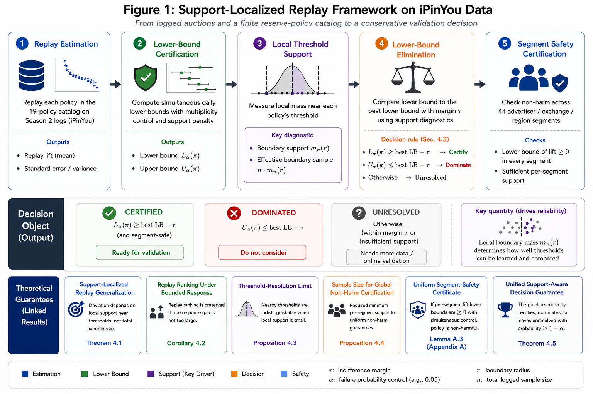

# Support-aware offline decision making for advertising marketplaces




This repository contains the notebook-first empirical code for the paper. The workflow is
scoped to the experiments described in Section 5 and Appendix B. The notebooks are the
public face of the analysis, and `src/` contains reusable code for data access, panel
construction, reserve-policy replay, lower-bound ranking, support diagnostics, segment
safety, out-of-time transfer, and robustness summaries.

Generated outputs are written to `artifacts/` and are ignored by Git. The raw iPinYou
archive is also ignored and should be supplied locally.

## Data

Place the original iPinYou archive at one of these paths:

```text
data/archive.zip
../data/archive.zip
```

The first path is the standalone GitHub layout. The second path is the local authoring
layout used when this paper folder sits next to the shared data folder.

## Setup

This project assumes `uv` is installed.

```bash
uv sync
uv run python -m ipykernel install --user --name support-aware-reserve-policy-selection
uv run jupyter lab
```

Open the notebooks from `notebooks/` and select the
`support-aware-reserve-policy-selection` kernel.

## Notebook Workflow

Run the notebooks in numeric order. Keep `ExperimentConfig(full_run=True)` for final paper
numbers. The setup notebooks produce the local panels; the remaining notebooks correspond
directly to Section 5 and Appendix B.

| Order | Notebook | Paper section | Main outputs |
| --- | --- | --- | --- |
| 00 | `00_ipinyou_data_audit_and_setup.ipynb` | Setup | Archive inventory and data contract |
| 01 | `01_ipinyou_panel_build.ipynb` | Setup | Season-two and season-three parquet panels |
| 02 | `02_conservative_shortlist_construction.ipynb` | Section 5.1 | Replay frontier, simultaneous lower-bound ranking, certified/dominated/unresolved labels |
| 03 | `03_support_localized_threshold_resolution.ipynb` | Section 5.2 | Boundary support sweep, support-adjusted lower bounds, threshold certification counts |
| 04 | `04_validation_readiness_transfer_segment_safety.ipynb` | Section 5.3 | Frozen season-three transfer, segment-level non-harm diagnostics |
| 05 | `05_appendix_b_robustness_and_diagnostics.ipynb` | Appendix B | Replay concentration, threshold support, shortlist robustness, subgroup safety, transfer stress tests, implementation details |

The code intentionally does not provide a one-shot pipeline command. The reproducible unit
is the ordered notebook workflow, with reusable implementation details kept in `src/`.

## Repository Contents

| Path | Purpose | Commit? |
| --- | --- | --- |
| `notebooks/` | Executed, notebook-first workflow for all reported experiments | Yes |
| `src/` | Reusable implementation used by the notebooks | Yes |
| `docs/` | README visual assets | Yes |
| `artifacts/` | Locally generated panels, figures, tables, and metadata | No |
| `data/` | Local raw iPinYou archive | No |
| `.venv/` | Local `uv` environment | No |

## Reproducibility Contract

- `artifacts/panels/` stores generated parquet panels.
- `artifacts/tables/` stores generated CSV tables.
- `artifacts/figures/` stores generated paper figures.
- `artifacts/metadata/` stores inventories and run metadata.
- `artifacts/`, `data/`, local environments, caches, and notebook checkpoints are ignored.

## Quick Checks

```bash
uv run python -m compileall src
PYTHONPATH=src uv run python - <<'PY'
from config import ProjectPaths
paths = ProjectPaths.infer_from_notebook()
print(paths)
print("iPinYou archive:", paths.ipinyou_archive)
PY
```

## License

This code is released under the MIT License.
